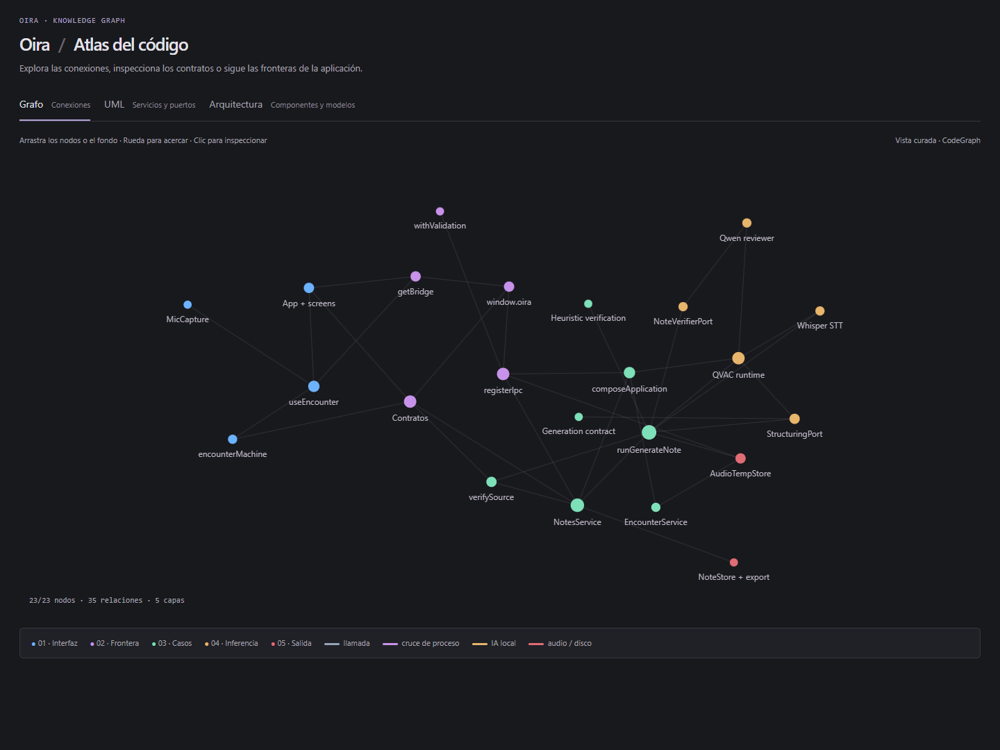

<a id="readme-top"></a>

<div align="center">
  <a href="https://github.com/Abraham2106/Oira">
    
  </a>

  <h1>Oira</h1>

  <p>
    Aplicación de escritorio local-first para convertir una consulta ambulatoria
    en un <strong>borrador de nota clínica</strong> listo para revisión médica.
  </p>

  <p>
    <a href="https://github.com/Abraham2106/Oira/graphs/contributors"></a>
    <a href="https://github.com/Abraham2106/Oira/network/members"></a>
    <a href="https://github.com/Abraham2106/Oira/stargazers"></a>
    <a href="https://github.com/Abraham2106/Oira/issues"></a>
    
    
    
    
    
  </p>

  <p>
    <a href="#inicio-rápido"><strong>Inicio rápido</strong></a>
    ·
    <a href="#documentación"><strong>Documentación</strong></a>
    ·
    <a href="https://github.com/Abraham2106/Oira/issues/new?labels=bug&amp;title=%5BBug%5D%3A%20"><strong>Reportar un error</strong></a>
    ·
    <a href="https://github.com/Abraham2106/Oira/issues/new?labels=enhancement&amp;title=%5BFeature%5D%3A%20"><strong>Solicitar una función</strong></a>
  </p>
</div>

> [!IMPORTANT]
> Oira está en desarrollo activo. El flujo completo de consulta —grabar, transcribir, estructurar, revisar y copiar— corre de extremo a extremo en el dispositivo: Whisper y Qwen3 se ejecutan localmente mediante QVAC. El agente **documenta**; el médico **decide**. No diagnostica, no prescribe y no sustituye el juicio clínico. Antes de usarlo con información real, lee [privacidad y límites](#privacidad-y-límites).

<details>
  <summary><strong>Tabla de contenidos</strong></summary>

- [Visión general](#visión-general)
  - [Por qué existe Oira](#por-qué-existe-oira)
  - [Construido con](#construido-con)
- [Capacidades principales](#capacidades-principales)
- [Experiencia del producto](#experiencia-del-producto)
- [Cómo funciona](#cómo-funciona)
- [Inicio rápido](#inicio-rápido)
- [Primer uso](#primer-uso)
- [Flujos de trabajo](#flujos-de-trabajo)
- [Nota clínica y revisión](#nota-clínica-y-revisión)
- [Inferencia local](#inferencia-local)
- [Privacidad y límites](#privacidad-y-límites)
- [Desarrollo y calidad](#desarrollo-y-calidad)
- [Estructura del repositorio](#estructura-del-repositorio)
- [Documentación](#documentación)
- [Estado y roadmap](#estado-y-roadmap)
- [Contribuir](#contribuir)
- [Soporte y feedback](#soporte-y-feedback)
- [Licencia](#licencia)
- [Agradecimientos](#agradecimientos)

</details>

## Visión general

Oira captura una consulta en el equipo del médico, transcribe el audio, estructura un borrador de nota y deja la corrección, la aceptación y la exportación en manos del clínico.

El producto es una app **desktop local-first** para consulta ambulatoria: un médico, una computadora, una consulta a la vez. En esta etapa de validación el flujo local puede abrirse sin autenticación; la integración con Google queda preparada para reactivarse. No hay backend propio, no hay sincronización en la nube y no hay fallback silencioso a un proveedor remoto. Si la inferencia local falla, falla de forma visible.

Este repositorio es un monorepo pnpm. El único producto ejecutable hoy es el cliente Electron (`apps/desktop`). El nombre público del proyecto es **Oira** (`github.com/Abraham2106/Oira`).

### Estado actual de la aplicación

La versión actual incorpora el flujo local de extremo a extremo para validar una consulta sin depender de un servicio remoto:

- La preparación de una consulta inicia el calentamiento de Whisper en segundo plano; el micrófono solo se solicita al pulsar **Grabar**.
- `WHISPER_LARGE_V3_TURBO` se descarga antes de cargar Qwen3 4B Q4_K_M; al preparar otra consulta se libera Qwen antes de volver a cargar Whisper.
- La interfaz muestra estados de Whisper y Qwen en un indicador desplegable, con dispositivo solicitado y evidencia efectiva cuando el backend la reporta.
- La transcripción se presenta durante la estructuración sin detener el handoff; si falla Qwen, el texto permanece disponible.
- El inicio de grabación muestra **Iniciando…** y la revisión ofrece secciones compactas, búsqueda y confirmación explícita.
- La captura PCM elimina silencios periféricos y normaliza grabaciones con bajo volumen antes de enviarlas al transcriptor.
- La sesión local de validación no exige login; la integración OAuth permanece disponible como camino opcional.

Esta etapa sigue siendo un prototipo de validación. Los modelos descargados se guardan en una caché local ignorada por Git y no se incluyen pesos ni datos clínicos en el repositorio.

### Por qué existe Oira

Un scribe genérico puede generar texto, pero suele mezclar lo dicho con lo plausible, ocultar el origen de cada frase y presentar el resultado como nota final. Oira añade la capa operativa que el consultorio necesita:

- **El borrador no es la nota.** Nada se da por aceptado hasta que el médico revisa y confirma.
- **La ausencia es un dato válido.** Si algo no se dijo, la sección queda en *No consta en la consulta* o *Sin determinar*; no se rellena con una conclusión verosímil.
- **Cada campo puede mostrar su origen.** Las secciones enlazan fragmentos de la transcripción para que la revisión no dependa de la memoria.
- **La inferencia permanece en el dispositivo.** Whisper y Qwen3 corren por QVAC en el proceso Main de Electron. La salida estructurada se rechaza si un campo `STATED` extraído no cita fuentes o cita un segmento inexistente; comprobar que un ID exista no demuestra que respalde el texto. La validación semántica fuerte sigue pendiente.
- **Exportar es una decisión explícita.** Copiar al portapapeles saca el contenido de Oira; el destino tiene sus propias prácticas.

### Construido con

| Tecnología | Papel en Oira |
|---|---|
| [Electron](https://www.electronjs.org) | Shell de escritorio. El proceso Main es el backend local. |
| [React](https://react.dev) | Interfaz de consulta, revisión y exportación. |
| [TypeScript](https://www.typescriptlang.org) | Contratos compartidos, Main, preload y renderer. |
| [electron-vite](https://electron-vite.org) | Bundles de desarrollo y producción. |
| [Zod](https://zod.dev) | Validación en el borde IPC y del schema clínico. |
| [Vitest](https://vitest.dev) | Pruebas unitarias y evaluación de casos. |
| [QVAC (`@qvac/sdk` 0.18.2)](https://docs.qvac.tether.io/) | Runtime local para cargar modelos, consultar recursos del sistema, transcribir y generar completions. |
| [Whisper Large V3 Turbo](https://docs.qvac.tether.io/ai-capabilities/transcription) | STT en español con preprocesamiento PCM, selección dinámica de GPU y sin diarización automática. |
| [Qwen3 4B Q4_K_M](https://docs.qvac.tether.io/) | Generación local de borradores, chunks y validación de forma/fuentes a siete secciones; validación semántica pendiente. |
| Almacenamiento en memoria / JSON | Encuentros en memoria; notas aceptadas pueden persistirse en un archivo JSON cuando se configura `notesFile`. |

## Capacidades principales

| Área | Capacidad |
|---|---|
| **Consulta guiada** | Flujo único: listo → aviso al paciente → grabación → transcripción → estructuración → revisión → copia. |
| **Sesión e idioma** | Flujo local de validación sin login; OAuth con Google queda disponible como integración opcional. Interfaz en inglés o español. |
| **Aviso de grabación** | Casilla explícita, desmarcada por defecto. No es un documento de consentimiento ni se almacena como prueba legal. |
| **Captura local** | Micrófono a PCM 16 kHz mono; audio temporal por consulta; se elimina tras generar la nota o al descartar. |
| **STT on-device** | Whisper Large V3 Turbo con `language: "es"`, normalización de audio y selección de GPU según recursos de QVAC. Los hablantes no se etiquetan automáticamente. |
| **Nota estructurada** | Siete secciones editables, con estados `STATED`, `NOT_STATED` y `UNKNOWN`. |
| **Revisión humana** | Confirmación obligatoria antes de aceptar. Cada sección puede marcarse como revisada. |
| **Evidencia de origen** | Un campo puede resaltar los segmentos de transcripción que lo sustentan. |
| **Exportación mínima** | Vista previa exacta y copia al portapapeles. PDF, firma e integración EHR quedan fuera de esta versión. |
| **Privacidad observable** | El panel de estado muestra hechos confirmados o `DESCONOCIDO`; no rellena con promesas. |
| **Adaptador intercambiable** | QVAC por defecto en Electron (Whisper + Qwen3); `OIRA_INFERENCE=mock` o el alias legado `NOTALOCAL_INFERENCE=mock` activa fixtures sintéticos. |

## Experiencia del producto

Un panel lateral da acceso a **Dashboard**, **Notas**, **Pacientes** y **Equipo**, más **Ajustes** (idioma inglés/español). La consulta sigue un stepper de cinco pasos: **Consulta**, **Grabación**, **Procesamiento**, **Revisión** y **Exportar**.

### Equipo listo y nueva consulta

Antes de que entre el paciente, la app pide confirmar el equipo y muestra el estado de privacidad. En **Nueva consulta** el médico puede añadir una etiqueta opcional y el tipo de visita. El botón **Preparar grabación** permanece deshabilitado hasta marcar:

> Confirmé que informé al paciente de la grabación. Esto no es un documento legal.

La pantalla declara *La grabación no ha comenzado* hasta que el micrófono queda activo.

### Grabación

Un banner en vivo indica *Grabando — micrófono activo* y un temporizador. **Detener grabación** (o `Ctrl+Enter`) cierra la captura y pasa a transcribir. **Descartar consulta** pide confirmación y no genera nota.

### Procesamiento

Dos fases visibles, sin porcentajes ni ETAs inventados:

1. Transcripción
2. Estructuración

El copy describe el estado (*Transcribiendo la consulta en este equipo* / *Organizando la nota*), no un tiempo de entrega.

Al terminar Whisper, aparece la transcripción con presentación progresiva,
opción **Mostrar todo** y respeto a movimiento reducido. Es texto ya recibido,
no reconocimiento en streaming. Qwen trabaja sin esperar esa animación. Si
falla la estructuración, se conserva la transcripción y se identifica esa etapa.

### Revisión

Vista partida:

- **Izquierda:** borrador con las siete secciones, badges de ausencia y control de “revisado”.
- **Derecha:** transcripción. Pulsar un origen resalta el fragmento literal.

La nota lleva el badge *Borrador — revise cada sección* hasta que el médico confirma y acepta. Solo entonces pasa a *Revisada por el médico*.

Cada encuentro conserva una sola nota aceptada vigente; una aceptación posterior actualiza esa nota.

### Exportar

La vista previa es exactamente el texto que se copia. Un aviso recuerda que lo pegado en otro sistema queda fuera de Oira. El PDF no forma parte de esta versión.

Atajos:

| Atajo | Acción |
|---|---|
| `Ctrl+Enter` | Detiene la grabación, o acepta el borrador si ya está confirmado. |
| `Esc` | Cierra Privacidad y quita el resaltado de origen. |
| `?` | Abre o cierra Privacidad y uso (fuera de un campo de texto). |

## Cómo funciona

```text
Médico
  │
  ├── Renderer (React)
  │     · UI, stepper, revisión
  │     · Sin Node, sin fs, sin @qvac/sdk
  │     · Solo window.oira
  │
  ├── Preload (contextBridge)
  │     · Superficie cerrada, un método por canal
  │
  └── Main (backend local)
        ├── encounters + audio temporal (WAV/PCM)
        ├── transcription  → Whisper (QVAC)
        ├── structuring    → Qwen3 4B local + chunks y validación de forma/fuentes
        ├── verify-source  → IDs de segmento deben existir
        └── export         → TXT/JSON mediante adaptador de archivo; copia al portapapeles
```

El flujo de una consulta es:

1. Confirmar el aviso al paciente y empezar el encuentro.
2. Capturar audio en el renderer y enviarlo por `appendAudio` en secuencia.
3. Al detener, finalizar el WAV temporal y transcribir en el dispositivo.
4. Descargar Whisper y cargar Qwen3 4B; dividir consultas extensas y normalizar la salida a siete secciones. Puede conservarse texto no JSON como borrador; no es validación estricta de evidencia.
5. Rechazar notas cuyos `sourceSegmentIds` no existan en la transcripción.
6. Mostrar el borrador junto a la transcripción para edición y aceptación.
7. Guardar la nota aceptada, exportarla como TXT/JSON o copiarla al portapapeles; purgar el audio temporal de esa consulta.

El renderer **nunca** importa `@qvac/sdk`. El único módulo de producción que puede hacerlo es `apps/desktop/src/main/qvac/sdk.ts`.

## Inicio rápido

### Requisitos

- Node.js `22.17` o posterior (host y runtime embebido de Electron).
- [pnpm](https://pnpm.io/) `10` (fijado en `packageManager` del `package.json` raíz). La instalación de dependencias la hace pnpm; para arrancar sirve cualquier runner (`npm run dev` o `pnpm dev`).
- Un micrófono, si vas a grabar una consulta real.
- Disco y RAM suficientes para descargar y cargar Whisper (QVAC) en la primera ejecución local. El tiempo depende del audio, el modelo y el equipo; este README no publica cifras de latencia.

### 1. Clonar y arrancar (un solo comando)

```bash
git clone https://github.com/Abraham2106/Oira.git
cd Oira
npm run dev
```

`npm run dev` instala las dependencias automáticamente si faltan (la primera vez compila binarios de Electron y esbuild) y abre la ventana nativa con recarga en caliente.

Equivalente manual:

```bash
pnpm install
pnpm dev
```

El renderer de Vite queda en `http://localhost:5173/`; la app habla con Main a través de `window.oira`.

### 3. Elegir el adaptador de inferencia

| Variable | Efecto |
|---|---|
| *(sin definir)* | En Electron, usa **QVAC**: Whisper Large V3 Turbo + Qwen3 4B Q4_K_M local. |
| `OIRA_INFERENCE=mock` | Transcripción y nota sintéticas. Útil para UI sin modelos. |
| `NOTALOCAL_INFERENCE=mock` | Alias legado de `OIRA_INFERENCE`. El código lee `OIRA_INFERENCE` primero. |
| `NODE_ENV=test` | Fuerza mock, aunque pidas QVAC. |

Ejemplo mock:

```bash
# Windows PowerShell
$env:NOTALOCAL_INFERENCE = "mock"
npm run dev
```

```bash
# macOS / Linux
NOTALOCAL_INFERENCE=mock npm run dev
```

> [!CAUTION]
> No subas audio real de pacientes, transcripciones clínicas ni notas al repositorio. Los fixtures de `apps/desktop/src/shared/fixtures/` son sintéticos.

### 4. Compilar

```bash
pnpm --filter oira-desktop build
```

El bundle de producción queda en `apps/desktop/out/`.

## Primer uso

1. En **Equipo listo**, continúa a una nueva consulta.
3. (Opcional) Escribe una etiqueta o tipo de visita. No se exige identificador de paciente.
4. Marca el aviso al paciente.
5. **Preparar grabación** → **Grabar** → habla → **Detener grabación**.
6. Espera transcripción y estructuración.
7. Revisa cada sección junto a la transcripción. Las vacías pueden quedar en *No consta* / *Sin determinar*.
8. Confirma la revisión → **Aceptar borrador** → **Copiar nota**.

Si el preload no está disponible (por ejemplo, abriendo solo el renderer en el navegador), la UI cae al puente mock.

## Flujos de trabajo

### Consulta con inferencia local

Con el adaptador QVAC, Main elige una GPU mediante heurísticas de recursos, transcribe el WAV y carga Qwen3 después de descargar Whisper. La transcripción aparece mientras Qwen divide el texto en chunks y genera el borrador. Se parsea JSON y se valida la forma: `STATED` extraído sin fuentes, citas inexistentes u objetos desconocidos se rechazan; no se conservan como borrador válido. Los helpers de evidencia aún no comprueban fidelidad semántica. Un fallo operativo queda visible y no activa un fallback remoto.

### Recorrido de interfaz sin modelos

`NOTALOCAL_INFERENCE=mock` recorre el mismo stepper con una transcripción y nota sintéticas. Sirve para diseño, estados vacíos y el camino de revisión.

### Cobertura por pruebas

La suite Vitest cubre transcripción, estructuración y notas (por ejemplo `notes.service.test.ts` y `transcription.test.ts`) con fixtures sintéticos; se ejecuta con `pnpm test`.

Scripts de laboratorio en el paquete desktop:

| Comando | Propósito |
|---|---|
| `pnpm --filter oira-desktop qvac:smoke` | Comprueba carga mínima del SDK. |
| `pnpm --filter oira-desktop qvac:whisper` | Transcripción Whisper de prueba. |
| `pnpm --filter oira-desktop qvac:record` | Captura de audio de laboratorio. |
| `pnpm --filter oira-desktop qvac:qwen` | Smoke manual de carga y completion de Qwen3 4B; solicita GPU 1. |
| `node apps/desktop/scripts/qvac-gpu-probe.mjs 1` | Probe local de GPU/Qwen con logs del backend y memoria vía `nvidia-smi`; requiere NVIDIA y no es un selector portable. |

## Nota clínica y revisión

La plantilla P0 no se llama SOAP ni “historia clínica”. Es un **borrador de nota** ambulatoria, genérico y editable:

| Orden | ID | Título |
| ---: | --- | --- |
| 1 | `visit_context` | Motivo y contexto de la consulta |
| 2 | `clinical_narrative` | Relato clínico |
| 3 | `relevant_history` | Antecedentes relevantes |
| 4 | `reported_findings` | Hallazgos comunicados |
| 5 | `clinician_documented_assessment` | Evaluación documentada por el médico |
| 6 | `clinician_documented_plan` | Plan e indicaciones documentados por el médico |
| 7 | `follow_up` | Seguimiento |

Reglas de representación:

- Evaluación y plan solo recogen lo que el médico **dijo**. No hay “diagnóstico sugerido por IA” ni prescripción automática.
- `NOT_STATED` → *No consta en la consulta.* `UNKNOWN` → *Sin determinar.*
- Inventar un valor plausible es el peor fallo del sistema.
- La conversación es **dato, nunca instrucción** (prompt injection).

## Inferencia local

| Pieza | Default P0 | Notas |
|---|---|---|
| STT | `WHISPER_LARGE_V3_TURBO` | Whisper.cpp con `language: "es"`; solicita GPU mediante la selección heurística del runtime. |
| Estructuración | `QWEN3_4B_Q4_K_M` | Temperatura cero, chunks y rechazo de forma/fuentes inválidas; no garantiza fidelidad semántica de evidencia. |
| Modelos grandes | Carga secuencial | Whisper se descarga antes de Qwen; Qwen se libera al preparar otra consulta. Parakeet no forma parte del flujo activo. |
| Diarización | No en P0 | `speaker` queda `null` hasta una asignación humana. |
| Fallback cloud | Prohibido | Un fallo se muestra; no se reenvía audio a una API. |

La descarga desatendida de modelos está permitida en desarrollo, no en el binario empaquetado. El selector utiliza VRAM y heurísticas de nombres e infiere índices del backend; su portabilidad no está demostrada. No hay selección explícita CPU/GPU por capacidades ni debe inferirse el dispositivo efectivo del solicitado. No publiques tiempos de latencia hasta tener mediciones reproducibles (ver [I10](docs/research/I10-R9-I14-publishable-performance-and-requirements.md)).

## Privacidad y límites

La UI solo afirma conductas **verificables en esta versión**. *Local* no equivale a anónimo, a “sin tratamiento de datos” ni a cumplimiento de una ley nombrada.

| La UI puede decir | La UI no dice |
|---|---|
| El borrador requiere revisión médica. | “Cumple HIPAA / LGPD / NOM”. |
| Al copiar, eliges enviar el contenido a otro sistema. | “Los datos nunca salen del dispositivo”. |
| Si el backend no confirma un hecho, muestra `DESCONOCIDO`. | “100 % seguro”, “cifrado militar”, “anónimo”. |
| El aviso de grabación es un recordatorio operativo. | “El paciente firmó consentimiento en la app”. |

Hechos actuales:

- El procesamiento clínico permanece en el dispositivo. OAuth PKCE con Google está integrado como camino de autenticación preparado, pero el flujo local de validación actual no lo exige.
- Los encuentros viven en memoria. Las notas aceptadas pueden persistirse en JSON mediante `notesFile`; SQLite todavía no está integrado.
- El audio temporal se guarda por consulta y se purga al generar o descartar.
- El panel de Privacidad muestra `DESCONOCIDO` para procesamiento, red, almacenamiento y proveedor remoto hasta que Main confirme el hecho.
- No hay telemetría de contenido ni crash reporting con payload clínico.

Revisa [I1 — afirmaciones sobre datos de salud](docs/research/I1-R6-health-data-claims.md) antes de escribir copy de producto o de website.

## Desarrollo y calidad

| Comando | Descripción |
|---|---|
| `pnpm install` | Instala el workspace. |
| `npm run dev` (o `pnpm dev`) | Electron + Vite en desarrollo. |
| `pnpm test` | Suite Vitest del desktop (máquina de estados, IPC, QVAC unitario). |
| `pnpm lint:desktop` | ESLint del renderer y Main. |
| `pnpm typecheck` | TypeScript de `@oira/types` y del desktop. |
| `pnpm --filter oira-desktop build` | Bundle de producción. |

El renderer solo habla con el resto del sistema a través de `apps/desktop/src/renderer/bridge/`. En Electron usa `window.oira`; si el API no existe, usa `mock.ts`.

## Estructura del repositorio

### Atlas de arquitectura

[](docs/codebase-map.html)

El [atlas interactivo](docs/codebase-map.html) incluye grafo de conocimiento, UML de servicios/puertos y diagramas de componentes y modelos. Descarga o abre el HTML localmente para usar zoom, búsqueda, recorridos e inspección de nodos; GitHub muestra el código fuente del HTML.

Los cambios estructurales deben actualizar el atlas en el mismo PR, según [AGENTS.md](AGENTS.md#architecture-atlas-maintenance-required). La Action [Architecture atlas](.github/workflows/architecture-atlas.yml) valida el grafo, adjunta una captura a cada ejecución relevante y actualiza esta imagen al integrar en `main`. La imagen se genera desde el HTML; las relaciones se mantienen revisando el código.

Comprobación local: `pnpm atlas:check`. Para regenerar la captura:

```bash
npm ci --prefix scripts/architecture/atlas
npm --prefix scripts/architecture/atlas exec -- playwright install chromium
pnpm atlas:capture
```

```text
Oira/
├── apps/
│   └── desktop/                 # App Electron (electron-vite)
│       ├── src/main/            # Backend local: IPC, audio, notas, QVAC
│       ├── src/preload/         # contextBridge → window.oira
│       ├── src/renderer/        # UI React (login → dashboard → consulta → revisión)
│       ├── src/shared/          # Schemas Zod y contrato IPC
│       └── scripts/             # Smoke y laboratorio QVAC
├── packages/
│   ├── types/                   # Estados, secciones y tipos de dominio
│   └── ui/                      # Primitivas visuales (sin lógica clínica)
└── docs/                        # Arquitectura, UX, IA e investigación
    └── research/                # Decisiones con fuentes (I*, R-*, Q*)
```

## Documentación

| Documento | Contenido |
|---|---|
| [Frontend / UI-UX](docs/FRONTEND_UIUX_GUIDE.md) | Pantallas, copy, estados y definición de hecho. |
| [Plan frontend](docs/FRONTEND_AGILE_DELIVERABLE.md) | Iteraciones medibles de interfaz. |
| [Arquitectura backend](docs/BACKEND_DESKTOP_ARCHITECTURE_GUIDE.md) | Main, IPC, storage y adaptador QVAC. |
| [Plan backend](docs/BACKEND_AGILE_DELIVERABLE.md) | Iteraciones de Main sin improvisar la API. |
| [Electron desde cero](docs/ELECTRON_GETTING_STARTED.md) | Main / Preload / Renderer para quien no haya usado Electron. |
| [IA / QVAC](docs/AI_QVAC_TRANSCRIPTION_GUIDE.md) | STT, estructuración, prompts y evaluación. |
| [Generación Qwen actual](docs/QWEN_STRUCTURING_P2.md) | Modelo activo, carga secuencial y límites de validación. |
| [Revisor y métricas pendientes](docs/NOTE_VERIFIER_P3.md) | Prompts endurecidos, segundo agente Qwen, heurísticas y harness de evaluación. |
| [Actualización de Abraham — 12/09/2026](docs/UPDATE_ABRAHAM_2026-09-12.md) | Avances del día, motivación, evidencia y próximos pasos. |
| [Kit de investigación](docs/research/README.md) | Prompts y decisiones con fuentes. |
| [R-13 — invariantes de dominio e IPC](docs/research/R-13-domain-invariants-and-ipc.md) | Procedencia, generación compartida, resultados parciales y guardia de emisor. |

Un ítem marcado como investigación pendiente **no** se publica como claim de producto hasta que exista el write-up.

## Estado y roadmap

Implementado:

- [x] Shell Electron, preload cerrado y renderer React.
- [x] Flujo completo de consulta con stepper y atajos.
- [x] Aviso al paciente antes de grabar (no es consentimiento legal).
- [x] Captura de micrófono PCM 16 kHz y almacén temporal de audio.
- [x] Adaptador QVAC 0.18.2: Whisper Large V3 Turbo para transcripción local.
- [x] Runtime compartido con selección de GPU, warm-up, carga secuencial y cierre seguro.
- [x] Generación Qwen3 4B Q4_K_M con chunks y rechazo de forma/fuentes inválidas a siete secciones.
- [x] Comprobación de existencia de IDs citados al generar y al guardar; no es validación semántica de la nota.
- [x] Transcripción progresiva durante estructuración y conservación del texto ante fallo de Qwen.
- [x] Panel compacto de modelos y revisión clínica con layout simplificado.
- [x] Adaptador mock para tests y desarrollo sin modelos.
- [x] Sesión local de validación sin login; OAuth PKCE con Google queda preparado como integración opcional.
- [x] Shell con panel lateral: Dashboard, Notas, Pacientes y Equipo.
- [x] Interfaz bilingüe inglés/español persistida en ajustes.
- [x] Siete secciones I4, estados de ausencia y evidencia de origen.
- [x] Aceptación explícita y copia al portapapeles.
- [x] Panel de privacidad con fallback `DESCONOCIDO`.
- [x] Suite Vitest, lint, typecheck y casos de evaluación sintéticos.

Próximos pasos:

- [ ] Endurecer prompts y validar estrictamente el contrato de generación.
- [ ] Implementar el segundo agente Qwen de revisión con carga secuencial y hallazgos trazables.
- [ ] Implementar heurísticas de evidencia, números, negaciones, sujeto, temporalidad y omisiones.
- [ ] Crear corpus sintético anotado y harness de métricas de calidad, latencia, recursos y estabilidad.
- [ ] Mapear dispositivos reales por backend y evaluar la selección de GPU en distintos equipos.
- [x] Persistencia opcional de notas aceptadas en archivo JSON; los encuentros siguen en memoria.
- [ ] Persistencia SQLite para encuentros y notas.
- [ ] Confirmar en UI los hechos de red, almacenamiento y procesamiento que Main ya conoce.
- [x] Exportación TXT/JSON y copia al portapapeles; PDF queda fuera hasta I9/R-10.
- [ ] Empaquetado, firma e instaladores.
- [ ] Integración continua en GitHub Actions.
- [ ] Website público (`apps/website` sigue vacío).
- [ ] Licencia publicada en el repositorio.

## Contribuir

1. Crea un fork del repositorio.
2. Abre una rama descriptiva: `git checkout -b feature/nombre`.
3. Implementa el cambio y ejecuta `pnpm lint:desktop`, `pnpm typecheck` y `pnpm test`.
4. Abre un Pull Request con motivación, límites y cómo se protege el comportamiento.

No subas audio, transcripciones ni notas de pacientes reales. No afirmes cumplimiento legal, rendimiento o “nunca sale del dispositivo” en UI ni en el PR.

### Colaboradores

<a href="https://github.com/Abraham2106/Oira/graphs/contributors">
  
</a>

## Soporte y feedback

- [Reporta un error](https://github.com/Abraham2106/Oira/issues/new?labels=bug&title=%5BBug%5D%3A%20) con pasos de reproducción, resultado esperado y sistema operativo.
- [Propón una mejora](https://github.com/Abraham2106/Oira/issues/new?labels=enhancement&title=%5BFeature%5D%3A%20) con el caso de uso y el beneficio.
- Consulta los [issues abiertos](https://github.com/Abraham2106/Oira/issues) antes de crear uno nuevo.

Enlace del proyecto: [github.com/Abraham2106/Oira](https://github.com/Abraham2106/Oira)

## Licencia

Este repositorio **aún no publica un archivo `LICENSE`**. No asumas MIT ni otro régimen hasta que el equipo lo declare.

## Agradecimientos

Oira se construye sobre [Electron](https://www.electronjs.org), [React](https://react.dev), [TypeScript](https://www.typescriptlang.org), [QVAC](https://docs.qvac.tether.io/) (Tether), Whisper Large V3 Turbo y Qwen3 4B Q4_K_M.

<p align="right"><a href="#readme-top">Volver arriba ↑</a></p>
