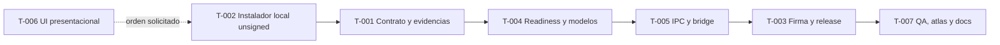

# TASK-PLAN v2

project: Oira
plan_id: OIRA-DESKTOP-DISTRIBUTION-001
plan_version: 1.0
canonical_source: TASK-PLAN.md
dashboard_target: TASK-DASHBOARD.html (derived only if requested; not part of this delivery)
status: draft
owner_role: product-technical-planner
created_at: 2026-09-14
updated_at: 2026-09-14

## Feature Layer

feature_id: OIRA-DESKTOP-DISTRIBUTION-001
feature_title: Instalación verificable y preparación inicial de modelos
rationale: Permitir que una persona externa instale Oira sin Node, pnpm, Git ni herramientas de desarrollo y sin ocultar descargas o garantías no verificadas.
priority: P0
status: blocked
goal: Entregar un instalador Windows x64 firmado que conduzca a una preparación local explícita, verifique el equipo y la integridad de Whisper/Qwen, y llegue a `DeviceReadyScreen` sin dependencias manuales.
scope_in:
- Instalador autocontenido para Windows x64 generado con Electron Forge y el plugin oficial de QVAC.
- Firma Authenticode del ejecutable y del instalador.
- Comprobación de sistema, RAM, disco y capacidades necesarias.
- Descarga explícita, progreso real, verificación y recuperación de Whisper/Qwen.
- Pantalla `Preparar Oira`, persistencia de estado y acceso posterior desde Ajustes.
- Contratos Main/IPC/preload/renderer, pruebas, documentación y atlas.
scope_out:
- Autoactualización.
- Microsoft Store, macOS y Linux.
- Fallback cloud o mock en producción.
- Descarga silenciosa, telemetría o contenido clínico de prueba.
- Selección avanzada o coexistencia permanente de múltiples versiones de modelos.
changed_subsystems:
- apps/desktop packaging and release
- main configuration and QVAC runtime
- shared schemas, IPC channels and API types
- preload and renderer bridge
- renderer startup, settings and i18n
- CI, tests, README and architecture atlas
constraints:
- Renderer solo mediante `src/renderer/bridge/`.
- Preload permanece CJS `index.cjs`, sandboxed y con superficie cerrada.
- Payloads IPC validados con Zod y sender guard existente.
- Descarga desatendida continúa prohibida en builds empaquetados.
- `DESCONOCIDO` o `NO VERIFICADO` cuando Main no confirme un hecho.
- Cero PHI, secretos, certificados o claves privadas en repositorio, logs y fixtures.
- Los cambios estructurales actualizan el atlas en la misma rama/PR.
assumptions:
- El MVP apunta a Windows x64 porque el paquete actual incluye runtime win32-x64.
- Los modelos activos continúan siendo `WHISPER_LARGE_V3_TURBO` y `QWEN3_4B_Q4_K_M` hasta que T-001 confirme el manifiesto.
- Electron Forge con `@qvac/sdk/electron-forge` es la ruta documentada por QVAC; T-001 fija el maker Windows después de un build real.
open_questions:
- Ver alarmas A-PH-001 a A-PH-005 en `FEATURE-PREPARATION.md`.
risks:
- El SDK puede mezclar descarga y carga sin exponer progreso o verificación suficientes.
- SmartScreen puede advertir sobre certificados nuevos aunque la firma sea válida.
- El empaquetado puede romper módulos nativos o el preload CJS.
- Requisitos inventados causarían fallos en equipos reales.
regression_risks:
- Inicio bloqueado indebidamente.
- Modelos descargados nuevamente en cada apertura.
- Inferencia QVAC funcional en desarrollo pero rota en app empaquetada.
- Canales IPC o mock bridge desincronizados.
security_privacy_notes:
- La descarga no contiene datos clínicos y ocurre antes de cualquier consulta.
- El origen y digest/firma de modelos son datos de seguridad, no copy promocional.
- La firma de la app se valida fuera del renderer; la UI solo representa evidencia de Main/OS.
- Los logs registran etapa, código y bytes; nunca URL con credenciales, rutas sensibles o contenido clínico.
non_functional_requirements:
- Reanudación segura cuando el mecanismo real la soporte; si no, reinicio explícito del archivo afectado.
- Progreso accesible y sin porcentajes/ETA ficticios.
- Fallo de red o integridad no debe dañar modelos previamente válidos.
- Segunda apertura lista no debe iniciar red ni descarga.
milestones:
- M0 gate de decisiones y spike QVAC cerrado
- M1 instalador reproducible y firmado
- M2 provisioning Main e IPC verificados
- M3 UI accesible integrada
- M4 release candidato probado en Windows limpio
timebox: unknown; scheduling is a non-critical project-owner decision
wiki_pages_to_read_before:
- README.md
- AGENTS.md
- VISION.md
- DESIGN.md
- docs/BACKEND_DESKTOP_ARCHITECTURE_GUIDE.md
- docs/AI_QVAC_TRANSCRIPTION_GUIDE.md
- docs/research/R-9-packaging-and-signing.md
- docs/research/I10-R9-I14-publishable-performance-and-requirements.md
wiki_pages_to_update_after:
- README.md
- docs/BACKEND_DESKTOP_ARCHITECTURE_GUIDE.md
- docs/codebase-map.html
- docs/assets/codebase-map.png
wiki_facts_to_capture:
- sistemas realmente soportados
- origen, versión e integridad de modelos
- ubicación de caché y política de recuperación
- procedimiento de build, firma, verificación y publicación
wiki_do_not_store:
- claves privadas
- contraseñas o tokens
- datos personales o clínicos
- URLs firmadas temporales

source_references:
- https://docs.qvac.tether.io/tutorials/electron/
- https://www.electronjs.org/docs/latest/tutorial/application-distribution
- https://www.electronjs.org/docs/latest/tutorial/code-signing

## Pre-Implementation Gate

feature_preparation_path: FEATURE-PREPARATION.md
preimplementation_status: blocked
entry_rule: T-006 puede construir y revisar la presentación sin datos ficticios; T-002 puede crear un instalador local unsigned después. Integración productiva, firma y publicación permanecen bloqueadas hasta cerrar sus alarmas.

## Active Alarms

feature_active_alarms:
- A-PH-001: identidad y certificado Authenticode ausentes
- A-PH-002: licencia y autorización de distribución ausentes
- A-PH-003: manifiesto verificable de modelos ausente
- A-PH-004: capacidades empaquetadas de QVAC no demostradas
- A-PH-005: requisitos mínimos no medidos
feature_resolved_alarms:
- none
alarm_source: FEATURE-PREPARATION.md
alarm_propagation: Cada task block incluye los IDs aplicables; cada prompt y handoff debe repetirlos hasta su resolución.

## Execution Governance

orchestration_mode: sequential_tasks
mode: CODE-FIRST, NO-FICTION, ONE-TASK-ONLY
task_order: T-006 -> T-002 -> T-001 -> T-004 -> T-005 -> T-003 -> T-007
ownership_rule: Respetar README; renderer/UI = Antonio, main/preload/IPC/storage/QVAC = Justin, STT/prompts/eval = IA.
no_fiction_policy: No inventar soporte, tamaños, porcentajes, firmas, resultados, archivos, commits ni aprobaciones.
mock_policy: No usar mock o fixture como evidencia de que descarga, firma o QVAC empaquetado funcionan en producción.
placeholder_policy: Los unknown críticos viven únicamente en alarmas activas y bloquean implementación/release.
prompt_policy: Un prompt por tarea con `RESUME_FROM`, scope, forbidden_areas, verification_strategy y alarmas activas.
code_first_policy: Las tareas T-002 a T-006 no cierran con documentación solamente.
done_policy: Done exige dependencias cerradas, aprobaciones nombradas, checks ejecutados, artefactos exactos, rollback y sync del atlas/documentación.
commit_policy: Un solo PR de feature; hashes reportados deben verificarse con `git rev-parse` y ser alcanzables desde HEAD.
sync_audit_policy: Task Register y task blocks deben coincidir antes de cada handoff.
boundary_audit_policy: Cambios fuera de scope vuelven la tarea a `needs_review`.
rollback_policy: Check requerido fallido implica forward-fix o revert; nunca avanzar directo a done.
timeout_escalation_policy: Tras dos loops de revisión, devolver al project owner/tech lead con evidencia y decisión requerida.

## Verification Policy

verification_planning_rule: Planner define; reviewer valida; tester ejecuta; commands_run solo registra comandos realmente ejecutados.
test_data_origin: synthetic-only
stop_on_failure: true
global_commands_planned:
- pnpm lint:desktop
- pnpm typecheck
- pnpm test
- pnpm --filter oira-desktop build
- pnpm atlas:check
- pnpm atlas:capture
manual_release_checks:
- Instalar y desinstalar en una VM Windows x64 limpia sin Node, pnpm ni Git.
- Verificar Authenticode del artefacto exacto.
- Ejecutar primer inicio online, interrupción de red, disco insuficiente, archivo inválido y segundo inicio offline.
- Revisar captura de `docs/assets/codebase-map.png` y capturas de estados UI.

## Task Register

| task_id | title | status | priority | owner_role | depends_on | required_approvals |
| --- | --- | --- | --- | --- | --- | --- |
| T-001 | Cerrar contrato de distribución y provisioning | needs_review | P0 | product-technical-planner | T-002 | product-owner, security-review, AI-QVAC-owner |
| T-002 | Generar instalador Windows x64 reproducible con Electron Forge/QVAC | needs_review | P0 | desktop-main-implementer | [] | main-owner, code-review |
| T-003 | Firmar y publicar artefactos de release | blocked | P0 | release-engineer | T-005 | security-release, product-owner |
| T-004 | Implementar readiness y provisioning en Main | needs_review | P0 | main-qvac-implementer | T-001 | main-owner, AI-QVAC-owner, code-review |
| T-005 | Exponer contratos e integrar la pantalla | needs_review | P0 | main-preload-implementer | T-004 | main-owner, security-review, code-review |
| T-006 | Implementar presentación de Preparar Oira | needs_review | P0 | UX-accessibility-reviewer | [] | renderer-owner, design-review, accessibility-review |
| T-007 | Validar release, actualizar atlas y documentar | needs_review | P0 | release-tester | T-003 | qa-signoff, architecture-review, product-owner |

## Tasks

### TASK T-001

task_id: T-001
title: Cerrar contrato de distribución y provisioning
rationale: Resolver hechos que no pueden convertirse en copy, código o garantías por intuición.
priority: P0
status: draft
owner_role: product-technical-planner
active_alarm_ids: [A-PH-001, A-PH-002, A-PH-003, A-PH-004, A-PH-005]
dependencies: [T-002]
blocked_by: [T-002]
unblocks: [T-004]
task_size: M
timebox: one planning and spike iteration
goal: Cerrar las cinco alarmas con decisiones y evidencia reproducible.
scope_in:
- identidad, certificado, custodia y revocación
- licencia y permisos de redistribución
- manifiesto de modelos y mecanismo de integridad
- spike QVAC 0.18.2 empaquetado
- matriz mínima de hardware/Windows
scope_out:
- código de producción de la pantalla o instalador final
changed_subsystems: [release-policy, QVAC-research, product-requirements]
candidate_files:
- FEATURE-PREPARATION.md
- TASK-PLAN.md
- docs/research/R-9-packaging-and-signing.md
- docs/research/I10-R9-I14-publishable-performance-and-requirements.md
forbidden_areas:
- código clínico y fixtures de pacientes
constraints:
- las pruebas del spike no prueban cumplimiento legal ni rendimiento general
open_questions:
- todas las preguntas de A-PH-001 a A-PH-005
risks:
- proveedor o SDK no ofrece material suficiente para verificación
security_privacy_notes:
- no registrar secretos ni URLs firmadas
acceptance_criteria:
- cada alarma queda `resolved` o la iniciativa se detiene con motivo explícito
- manifiesto y requisitos tienen fuente/evidencia aprobada
- se define maker Windows y nombre exacto del artefacto de instalación
verification_strategy:
- tests_required: manual-check-needed
- test_levels: [smoke, manual-check-needed]
- oracle: spike empaquetado reproduce descarga/progreso/integridad y las decisiones tienen aprobación por rol
- negative_tests: offline, descarga interrumpida, digest inválido y equipo debajo del mínimo
- commands_planned: definidos en el write-up del spike según API real de QVAC; no se inventan antes
- commands_run: []
expected_artifacts:
- feature gate actualizado
- write-up de investigación con fuentes y evidencia local
- manifiesto aprobado o decisión documentada de no continuar
rollback_plan:
- descartar el spike y mantener distribución externa bloqueada
agent_sequence: [planner, QVAC-spike-implementer, security-reviewer, product-approver]
agent_contracts:
- planner entra con este plan, produce preguntas cerradas y entrega al spike implementer; se detiene si falta authority externa
- QVAC-spike-implementer entra con modelo/origen permitido, produce logs no sensibles y entrega a security reviewer; se detiene si exige PHI o secretos en repo
- security-reviewer valida firma/integridad/licencias y entrega hallazgos al product approver; máximo dos loops
- product-approver cierra alarmas o bloquea la feature con una decisión registrada
required_approvals: [product-owner, security-review, AI-QVAC-owner]
max_review_loops: 2
escalation_rule: Si una alarma no puede cerrarse localmente, detener implementación y pedir decisión al project owner.
exit_criteria: Gate de integración `complete`, alarmas resueltas y T-004 promovida a ready.

### TASK T-002

task_id: T-002
title: Generar instalador Windows x64 reproducible con Electron Forge/QVAC
rationale: Convertir el bundle electron-vite en una aplicación instalable sin herramientas de desarrollo.
priority: P0
owner_role: desktop-main-implementer
active_alarm_ids: [A-PH-002]
status: needs_review
dependencies: []
blocked_by: []
unblocks: [T-001]
task_size: M
goal: Producir `apps/desktop/out/make/squirrel.windows/x64/Oira-Setup-x64.exe` y una app empaquetada funcional para revisión local sin firma.
scope_in:
- Electron Forge, `QvacForgePlugin` y maker Windows x64 aprobado
- metadata, iconos, archivos incluidos y exclusiones
- scripts `package:desktop` y `make:desktop`
- `app.isPackaged` y rutas `userData`/temp reales
scope_out:
- firma, autoactualización y otros sistemas operativos
candidate_files:
- package.json
- pnpm-lock.yaml
- apps/desktop/package.json
- apps/desktop/forge.config.cjs (new)
- apps/desktop/qvac.config.json (new if explicit plugin pruning is approved)
- apps/desktop/electron.vite.config.ts
- apps/desktop/src/main/index.ts
- apps/desktop/src/main/config/*
forbidden_areas:
- renderer clinical copy and note-generation prompts
constraints:
- preload continúa CJS `index.cjs`
- `QvacForgePlugin` controla `asar: false`; no intentar habilitar ASAR porque el worker Bare necesita rutas reales
- el output electron-vite se mueve a `dist/` para no colisionar con `out/` de Forge
- solo electron y esbuild mantienen permiso de install scripts salvo evidencia explícita
acceptance_criteria:
- instalación y apertura funcionan en Windows limpio sin Node/pnpm/Git
- desinstalación no elimina notas/datos sin confirmación/política explícita
- QVAC y dependencias nativas cargan desde el paquete
verification_strategy:
- tests_required: yes
- test_levels: [unit, integration, smoke, manual-check-needed]
- oracle: artefacto existe con nombre exacto, instala, abre ventana y Main reporta runtime embebido compatible
- negative_tests: ruta con espacios, usuario estándar y directorio sin permisos
- commands_planned: [pnpm install, pnpm package:desktop, pnpm typecheck, pnpm test]
- commands_run: [pnpm package:desktop, pnpm make:desktop, pnpm typecheck, pnpm lint:desktop, pnpm test, pnpm atlas:check, pnpm atlas:capture, Get-AuthenticodeSignature, Get-FileHash]
expected_artifacts:
- apps/desktop/out/make/squirrel.windows/x64/Oira-Setup-x64.exe unsigned candidate
- configuración y pruebas de empaquetado
observed_evidence:
- candidato 0.0.3 generado; SHA-256 `E50E37C794500CD60B3CA39659C4911C667EB39885A49E6C365CF1993B18AFDF`
- Authenticode `NotSigned`, esperado hasta T-003
- bundle Main empaquetado sin imports residuales de `@oira/types` ni paquetes `@qvac/*`
- `.nupkg` extraído en directorio temporal; DevTools local confirmó `title: Oira` y el `renderer/index.html` empaquetado
rollback_plan:
- retirar scripts/configuración del packager y conservar `electron-vite build`
agent_sequence: [implementer, reviewer, tester, docs-sync]
agent_contracts:
- implementer produce el candidato local sin firma y entrega config/diff a reviewer; publicación espera T-001/T-003
- reviewer valida contenidos, preload, rutas y límites; entrega a tester o devuelve correcciones
- tester ejecuta build e instalación limpia; guarda logs/capturas sin datos sensibles
- docs-sync actualiza comandos de desarrollo/distribución sin marcar firma como terminada
required_approvals: [main-owner, code-review]
max_review_loops: 2
escalation_rule: Incompatibilidad nativa vuelve la tarea a planner con el módulo y evidencia exactos.
exit_criteria: Instalador unsigned reproducible validado; T-003 puede pasar a ready.

### TASK T-003

task_id: T-003
title: Firmar y publicar artefactos de release
rationale: Permitir que Windows verifique el publicador y evitar secretos de firma dentro del repositorio.
priority: P0
status: draft
owner_role: release-engineer
active_alarm_ids: [A-PH-001, A-PH-002]
dependencies: [T-005]
blocked_by: [A-PH-001, A-PH-002]
unblocks: [T-007]
task_size: M
goal: Firmar ejecutable e instalador en CI y publicar un release verificable.
scope_in:
- workflow de release versionado y manual/tagged
- inyección segura del certificado o servicio de firma aprobado
- timestamp y verificación Authenticode
- hashes del instalador y retención de evidencia
scope_out:
- almacenar PFX/password en Git, autoactualización o publicación Store
candidate_files:
- .github/workflows/release-desktop.yml (new)
- apps/desktop/forge.config.cjs
- README.md
forbidden_areas:
- secretos, `.env`, certificados privados y datos clínicos
acceptance_criteria:
- `Oira-Setup-x64.exe` y el ejecutable instalado tienen Authenticode `Valid`
- el subject coincide con el publicador aprobado y existe timestamp
- workflow no expone secretos y no publica si falla firma o tests
verification_strategy:
- tests_required: yes
- test_levels: [integration, smoke, manual-check-needed]
- oracle: `Get-AuthenticodeSignature` y/o `signtool verify /pa /v` devuelve estado válido sobre artefactos exactos
- negative_tests: secreto ausente, firma inválida, artefacto alterado y tag/version mismatch
- commands_planned:
  - pnpm release:desktop
  - powershell -NoProfile -Command "(Get-AuthenticodeSignature -LiteralPath 'apps/desktop/out/make/squirrel.windows/x64/Oira-Setup-x64.exe').Status"
- commands_run: []
expected_artifacts:
- instalador firmado
- hash publicado
- log de verificación sanitizado
rollback_plan:
- retirar el release; revocar/rotar certificado según procedimiento aprobado si hay compromiso
agent_sequence: [release-implementer, security-reviewer, tester, product-approver]
agent_contracts:
- release-implementer configura CI sin secretos en archivos y entrega workflow/run al reviewer
- security-reviewer inspecciona permisos, firma, timestamp y logs; máximo dos loops
- tester descarga el artefacto publicado y verifica firma/hash fuera del workspace de build
- product-approver autoriza publicación o retira el release
required_approvals: [security-release, product-owner]
max_review_loops: 2
escalation_rule: Fallo de firma o custodia bloquea publicación; no se distribuye unsigned.
exit_criteria: Release firmado verificable y procedimiento de revocación documentado.

### TASK T-004

task_id: T-004
title: Implementar readiness y provisioning en Main
rationale: Mantener filesystem, red, QVAC e integridad fuera del renderer.
priority: P0
status: draft
owner_role: main-qvac-implementer
active_alarm_ids: [A-PH-003, A-PH-004, A-PH-005]
dependencies: [T-001]
blocked_by: [A-PH-003, A-PH-004, A-PH-005]
unblocks: [T-005]
task_size: L
decomposition_rule: Dividir implementación y pruebas internas si el adapter QVAC requiere más de un mecanismo de descarga; mantener un solo contrato de aplicación.
goal: Main devuelve estado confiable del equipo/modelos y ejecuta provisioning explícito con verificación y recuperación.
scope_in:
- tipos de setup/readiness/progress
- cálculo de disco/RAM/sistema con umbrales aprobados
- estado persistido derivado de evidencia, no booleano ciego
- provisioning QVAC, integridad y limpieza selectiva del artefacto inválido
- eventos de progreso sin PHI
scope_out:
- UI, IPC, carga paralela permanente de Whisper y Qwen o fallback cloud
candidate_files:
- apps/desktop/src/main/inference/port.ts
- apps/desktop/src/main/qvac/inference-runtime.ts
- apps/desktop/src/main/qvac/sdk.ts
- apps/desktop/src/main/config/*
- apps/desktop/src/main/composition/compose-application.ts
- apps/desktop/src/main/setup/* (new only if the spike proves a separate service is needed)
- apps/desktop/src/shared/types/setup.ts (new)
forbidden_areas:
- renderer direct imports of Node or `@qvac/sdk`
- clinical note schemas and prompts
acceptance_criteria:
- segundo inicio válido no usa red ni descarga
- corrupción, falta de disco y red caída producen códigos recuperables y seguros
- ninguna ruta marca ready sin verificar presencia, versión e integridad según contrato aprobado
- la descarga requiere llamada explícita en app empaquetada
verification_strategy:
- tests_required: yes
- test_levels: [unit, integration]
- oracle: transiciones deterministas y archivos finales solo aparecen después de verificación atómica
- negative_tests: digest inválido, descarga parcial, cancelación/cierre, cero espacio, manifiesto desconocido y QVAC error
- commands_planned:
  - pnpm --filter oira-desktop exec vitest run src/main/setup
  - pnpm --filter oira-desktop exec vitest run src/main/qvac/inference-runtime.test.ts
  - pnpm typecheck
- commands_run:
  - pnpm --filter oira-desktop exec vitest run src/main/setup/service.test.ts
  - pnpm test
  - pnpm typecheck
  - pnpm lint:desktop
expected_artifacts:
- servicio/adapter real de setup
- pruebas unitarias e integración
- logs estructurados sin contenido sensible
rollback_plan:
- deshabilitar el nuevo gate solo retirando el release; no reactivar descarga desatendida en producción
agent_sequence: [planner, main-QVAC-implementer, reviewer, tester]
agent_contracts:
- planner congela contrato desde T-001 y entrega al implementer
- implementer modifica Main/QVAC con tests y entrega diff al reviewer
- reviewer valida integridad, atomicidad, limpieza y ausencia de claims no probados
- tester ejecuta casos positivos/negativos; un rojo bloquea T-005
required_approvals: [main-owner, AI-QVAC-owner, code-review]
max_review_loops: 2
escalation_rule: Si QVAC no permite el contrato aprobado, volver a T-001; no simular progreso o verificación.
exit_criteria: Servicio real aprobado y pruebas requeridas verdes.

### TASK T-005

task_id: T-005
title: Exponer contratos IPC, preload y bridge e integrar la pantalla
rationale: Entregar al renderer una superficie mínima, validada y observable sin romper el sandbox.
priority: P0
status: draft
owner_role: main-preload-implementer
active_alarm_ids: [A-PH-004]
dependencies: [T-004]
blocked_by: [T-004]
unblocks: [T-003]
task_size: M
goal: Exponer getSetupStatus, provisionModels y progreso mediante canales cerrados y schemas Zod.
scope_in:
- constantes de canales/eventos
- schemas de inputs/results
- handler IPC y registro
- `OiraApi`, preload y adaptadores renderer real/mock
- tests de sender guard, validación y unsubscribe
- conexión de `ModelSetupScreen` en `App.tsx` y resumen real en Ajustes
scope_out:
- lógica de descarga o validación en renderer
candidate_files:
- apps/desktop/src/shared/constants/ipc-channels.ts
- apps/desktop/src/shared/schemas/ipc.schema.ts
- apps/desktop/src/shared/types/oira-api.ts
- apps/desktop/src/main/ipc/index.ts
- apps/desktop/src/main/ipc/setup.ipc.ts (new)
- apps/desktop/src/preload/index.ts
- apps/desktop/src/renderer/bridge/ipc.ts
- apps/desktop/src/renderer/bridge/oira.ts
- apps/desktop/src/renderer/bridge/mock.ts
- apps/desktop/src/renderer/App.tsx
- apps/desktop/src/renderer/screens/ModelSetup/ModelSetup.tsx
- apps/desktop/src/renderer/screens/Settings/Settings.tsx
forbidden_areas:
- Node/QVAC imports in renderer
- bypass de `withTrustedIpcSender`
acceptance_criteria:
- todos los inputs se validan y errores se serializan sin rutas/secretos
- preload mantiene CJS y expone solo métodos necesarios
- listeners se pueden liberar y mock no se usa en packaged production
verification_strategy:
- tests_required: yes
- test_levels: [unit, integration]
- oracle: tests prueban contrato real, validación, sender no confiable y ciclo subscribe/unsubscribe
- negative_tests: payload inválido, renderer no confiable, llamada duplicada y error Main
- commands_planned:
  - pnpm --filter oira-desktop exec vitest run src/main/ipc/register.test.ts src/renderer/bridge/ipc.test.ts src/renderer/bridge/oira.test.ts
  - pnpm typecheck
- commands_run:
  - pnpm test
  - pnpm typecheck
  - pnpm lint:desktop
expected_artifacts:
- contrato setup completo desde Main hasta bridge
- pruebas IPC/preload/bridge
rollback_plan:
- retirar canales y métodos como una unidad; conservar T-004 inaccesible hasta replanificar
agent_sequence: [implementer, security-reviewer, tester]
agent_contracts:
- implementer entra con servicio T-004 estable y entrega contrato más pruebas
- security-reviewer valida superficie, schemas, sender guard y serialización
- tester ejecuta tests y typecheck; entrega a renderer solo con verde
required_approvals: [main-owner, security-review, code-review]
max_review_loops: 2
escalation_rule: Desacuerdo de contrato vuelve a T-004 planner antes de agregar excepciones.
exit_criteria: Bridge real y mock contract-compatible aprobados, preload CJS verificado.

### TASK T-006

task_id: T-006
title: Implementar presentación de Preparar Oira
rationale: Resolver primero la estructura visual y todos sus estados sin esperar certificados ni simular un backend.
priority: P0
status: needs_review
owner_role: UX-accessibility-reviewer
active_alarm_ids: []
dependencies: []
blocked_by: [renderer-owner approval]
unblocks: [T-002]
task_size: M
goal: Entregar un componente accesible, bilingüe y prop-driven para los siete estados, sin conectarlo aún a producción.
scope_in:
- secciones Equipo, Modelos locales, Seguridad e integridad
- estados checking, blocked, ready_to_download, downloading, verifying, error y ready
- copy ES/EN que mantiene hechos no confirmados como UNKNOWN/DESCONOCIDO
- CTA, progreso determinado/indeterminado, estados responsive y semántica accesible
scope_out:
- integración en `App.tsx`, navegación, persistencia, descarga, firma real o entrada de Ajustes
- hero, wizard multipágina, ETA inventada, badges autodeclarados o descarga automática
candidate_files:
- apps/desktop/src/renderer/screens/ModelSetup/ModelSetup.tsx
- apps/desktop/src/renderer/screens/ModelSetup/ModelSetup.test.ts
- apps/desktop/src/renderer/i18n/dictionary.ts
- apps/desktop/src/renderer/styles/index.css
forbidden_areas:
- `ProductState` y encounterMachine
- acceso directo a fs, red o QVAC
- claims legales, rendimiento no medido o contenido clínico
acceptance_criteria:
- CTA y mensajes corresponden al estado recibido por props
- el componente no está montado en producción antes de T-005
- porcentaje solo aparece con total conocido
- teclado, foco, lector de pantalla y layout responsive cubren la presentación
verification_strategy:
- tests_required: yes
- test_levels: [unit, integration, e2e, manual-check-needed]
- oracle: assertions DOM por cada estado, navegación correcta y captura aprobada a 1280x840 y mínimo 960x640
- negative_tests: offline, poco disco, firma desconocida, digest inválido, progreso sin total y reintento
- commands_planned:
  - pnpm --filter oira-desktop exec vitest run src/renderer/screens/ModelSetup/ModelSetup.test.ts
  - pnpm lint:desktop
  - pnpm typecheck
  - pnpm dev:desktop
- commands_run:
  - pnpm.cmd --filter oira-desktop exec vitest run src/renderer/screens/ModelSetup/ModelSetup.test.ts
  - pnpm.cmd typecheck
  - pnpm.cmd lint:desktop
  - node C:/Users/solan/.codex/skills/webapp-ui-skill/scripts/check_state_coverage.ts --root C:/Users/solan/Documents/Personal/Hackathon/Oira --out reports/state-coverage.json
  - node capture-model-setup-temp.mjs (temporary local Playwright harness; removed after capture)
expected_artifacts:
- pantalla, estilos, copy ES/EN y pruebas
- reports/model-setup-desktop.png
- reports/model-setup-mobile.png
- reports/state-coverage.json
rollback_plan:
- revertir ruta/componentes junto con métodos de bridge no usados; no saltar el gate en release publicado
agent_sequence: [renderer-implementer, tester, UX-accessibility-reviewer]
agent_contracts:
- implementer produce UI/tests prop-driven sin lógica de sistema ni integración productiva
- UX-accessibility-reviewer inspecciona jerarquía, estados, copy y teclado; máximo dos loops
- tester ejecuta tests y revisión visual local; entrega evidencia a T-007
required_approvals: [renderer-owner, design-review, accessibility-review]
max_review_loops: 2
escalation_rule: Si la UI necesita un dato no expuesto, volver a T-005; no inferirlo en renderer.
exit_criteria: Componente, test, typecheck y lint verdes más evidencia visual local; luego T-002 pasa a ready.

### TASK T-007

task_id: T-007
title: Validar release, actualizar atlas y documentar
rationale: Probar la experiencia completa en un equipo limpio y mantener la arquitectura canónica sincronizada.
priority: P0
status: draft
owner_role: release-tester
active_alarm_ids: [A-PH-001, A-PH-002, A-PH-003, A-PH-004, A-PH-005]
dependencies: [T-003]
blocked_by: [T-002, T-003, T-004, T-005, T-006]
unblocks: []
task_size: L
goal: Aprobar o rechazar un release candidato con evidencia funcional, visual, de seguridad y arquitectura.
scope_in:
- suite completa, build, firma, instalación/desinstalación y matriz de fallos
- prueba online inicial y segundo inicio offline
- atlas HTML/PNG, README y guías
- inventario final de licencias/avisos
scope_out:
- claims de cumplimiento o performance no medidos
candidate_files:
- README.md
- docs/BACKEND_DESKTOP_ARCHITECTURE_GUIDE.md
- docs/codebase-map.html
- docs/assets/codebase-map.png
- reports/model-setup-* (generated local evidence; commit policy decided by reviewer)
forbidden_areas:
- datos clínicos reales, perfiles del navegador, certificados y secretos
acceptance_criteria:
- externo instala, prepara modelos, configura micrófono y abre Nueva consulta sin herramientas dev
- firma e integridad válidas desde artefacto descargado
- fallos recuperables coinciden con UI y no destruyen modelos válidos
- atlas refleja setup service, IPC, descarga, firma/distribución y flujo renderer
- documentación distingue requisitos medidos de desconocidos
verification_strategy:
- tests_required: yes
- test_levels: [unit, integration, e2e, smoke, manual-check-needed]
- oracle: todos los comandos requeridos verdes, Authenticode válido, checklist Windows limpio aprobado y capturas revisadas
- negative_tests: todos los casos definidos en FEATURE-PREPARATION más manipulación del instalador/modelo
- commands_planned:
  - pnpm lint:desktop
  - pnpm typecheck
  - pnpm test
  - pnpm package:desktop
  - pnpm atlas:check
  - pnpm atlas:capture
  - powershell -NoProfile -Command "(Get-AuthenticodeSignature -LiteralPath 'apps/desktop/out/make/squirrel.windows/x64/Oira-Setup-x64.exe').Status"
- commands_run: []
expected_artifacts:
- release candidato firmado
- reporte de prueba limpio y capturas
- atlas actualizado y documentación final
rollback_plan:
- bloquear/retirar release y reabrir la primera tarea fallida; nunca aprobar parcialmente un artefacto unsigned o corrupto
agent_sequence: [tester, security-reviewer, architecture-reviewer, docs-sync, product-approver]
agent_contracts:
- tester instala artefacto descargado en Windows limpio y produce evidencia sanitizada
- security-reviewer valida firma, hashes, origen y manejo de secretos
- architecture-reviewer valida boundaries, IPC y atlas
- docs-sync actualiza README/guías con hechos ejecutados
- product-approver aprueba release o lo retira con blocker exacto
required_approvals: [qa-signoff, security-release, architecture-review, product-owner]
max_review_loops: 2
escalation_rule: Cualquier fallo de firma, integridad, clean install o test requerido bloquea publicación y reabre la tarea propietaria.
exit_criteria: Release publicado, evidencia exacta registrada, atlas/documentación sincronizados y todas las alarmas resueltas.

## Dependency Graph

## Decision Log

- 2026-09-14: Se adopta Windows x64 + Electron Forge + `QvacForgePlugin`; el maker final se decide con un build real.
- 2026-09-14: La preparación usa una sola pantalla antes de `DeviceReadyScreen`.
- 2026-09-14: Firma del instalador e integridad de modelos se tratan como verificaciones distintas.
- 2026-09-14: El renderer no calcula compatibilidad ni valida archivos; consume hechos de Main.
- 2026-09-14: No se agrega un estado a `ProductState`; setup queda fuera de la máquina del encuentro.
- 2026-09-14: T-006 puede avanzar como UI presentacional; los hechos de seguridad y la integración productiva siguen bloqueados por alarmas.
- 2026-09-14: El usuario prioriza UI presentacional y luego instalador local; firma/publicación se difieren hasta obtener certificado.
