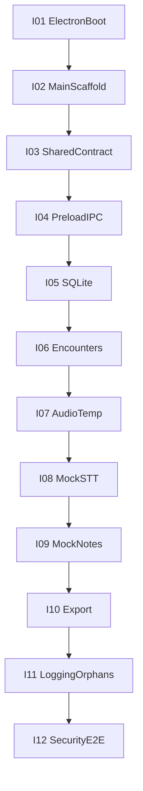

# Entregable backend — 12 iteraciones medibles (sin QVAC)

> Plan agile del primer entregable backend de NotaLocal.
> Cada iteración cierra con un criterio pass/fail verificable en minutos.
> Referencia de arquitectura: [BACKEND_DESKTOP_ARCHITECTURE_GUIDE.md](BACKEND_DESKTOP_ARCHITECTURE_GUIDE.md).

## Contexto

Entregable de Justin: **Electron Main como backend local** (IPC, SQLite, audio temp, encounters, notes, export, logging, seguridad) **sin conectar `@qvac/sdk`**.

La inferencia se consume solo vía un **puerto/interface** (`InferencePort`) con implementación **`mock`** determinista. El adapter real de QVAC queda fuera de este entregable (P1+ / guía §7 y §24 P0-5 real).

**Regla de corte:** una iteración = **1 objetivo + 1 criterio pass/fail**. Si no se verifica en <5 minutos, es demasiado grande.

**Alineación con frontend:** los 4 métodos del contrato (`startEncounter`, `stopEncounter`, `generateNote`, `saveNote`) coinciden con lo que Antonio espera en `window.notalocal.*`.

---

## Cómo medir cada iteración

| Campo | Uso |
| --- | --- |
| **Hecho** | Lista corta de módulos/comportamiento |
| **Medible** | Comando o checklist binario (sí/no) |
| **DoD común** | Compila; sin PHI en logs; sin `@qvac/sdk`; sin red para inferencia; commit listo |

**Fuera de alcance de este entregable:**

- Instalar o importar `@qvac/sdk`
- Descarga de modelos / `downloadAsset` / registry
- R-1 empaquetado con plugin QVAC, R-4 memoria de modelos, R-7 offline “con modelos”
- Auth PIN, retención configurable avanzada, PDF, streaming STT, diarización
- Express / Firebase / cualquier HTTP local o cloud

**Decisión de mock:** `transcription.adapter.mock` y `structuring.adapter.mock` viven bajo `src/main/inference/` (o `src/main/qvac/` solo como carpeta de puerto, **sin** SDK). `rg "@qvac/sdk"` sobre el repo del entregable = **0 hits**.

---

## I01 — Electron Main arranca (sin QVAC)

**Hecho:** scaffold Electron + TypeScript en `apps/desktop` (Main entry); `contextIsolation: true`, `nodeIntegration: false`; ventana mínima.

**Medible:**

- [ ] `pnpm --filter desktop dev` (o script equivalente) abre la app
- [ ] Main loguea “ready” sin importar QVAC
- [ ] `package.json` **no** lista `@qvac/sdk`

---

## I02 — Estructura Main + lint de fronteras

**Hecho:** carpetas §2: `config`, `ipc`, `encounters`, `audio`, `transcription`, `notes`, `storage`, `export`, `logging`, `inference` (puerto+mock), `utils`; preload; `shared/`.

**Medible:**

- [ ] Árbol de carpetas existe con entry points stub
- [ ] Lint/regla de boundaries: `services` no importan `ipc`; test que un import ilegal falla el lint
- [ ] `rg "@qvac/sdk" apps/desktop` → 0 resultados

---

## I03 — Contrato shared (schemas + errores)

**Hecho:** `shared/schemas` + `shared/constants`: canales IPC, `ProductState`/estados encounter, `AppError` tipado, Zod de payloads de los 4 métodos + `StructuredClinicalFacts` mínimo (7 secciones alineadas a I4 frontend).

**Medible:**

- [ ] `tsc` de `shared` pasa
- [ ] Payload inválido de `startEncounter` falla Zod con código tipado
- [ ] Documento corto del contrato IPC v1 referenciado desde este file (o sección abajo)

---

## I04 — Preload + IPC con Zod

**Hecho:** `contextBridge.exposeInMainWorld('notalocal', { startEncounter, stopEncounter, generateNote, saveNote })`; handlers IPC que validan → llaman stub service → devuelven `Result`.

**Medible:**

- [ ] Renderer (o script de smoke) llama `window.notalocal.startEncounter({})` y recibe `ok` o error tipado
- [ ] No existe `invoke(channel, args)` genérico en preload
- [ ] Error IPC **no** incluye `stack`, `cause` ni rutas absolutas

---

## I05 — SQLite + migraciones

**Hecho:** binding local (p. ej. `better-sqlite3` o `node:sqlite`); DB en ruta inyectable; migración `001_init` con 5 tablas §8.2; `PRAGMA foreign_keys = ON`.

**Medible:**

- [ ] Migración corre al arrancar Main (o en test harness)
- [ ] Test: borrar encounter cascada borra transcript / notes / versions
- [ ] Test: no hay columna BLOB de audio en schema

---

## I06 — Encounters + máquina de estados

**Hecho:** `encounter.service` + `canTransition`; estados §3 (`created` → `recording` → `transcribing` → `transcribed` → `drafting` → `drafted` → `completed` / `failed` / `discarded`); un solo encounter activo.

**Medible:**

- [ ] Vitest: transición válida `created` → `recording` OK
- [ ] Vitest: `drafted` → `completed` sin pasar por aprobación explícita **falla** (o equivalente: solo `saveNote` aprueba)
- [ ] Vitest: segundo `startEncounter` con uno en `recording` → error tipado

---

## I07 — Audio temp + cleanup

**Hecho:** `/audio`: escribir chunks a directorio temp del encounter; validar extensión permitida; `safeJoin` contra path traversal; cleanup de ficheros.

**Medible:**

- [ ] Tras `stopEncounter` (o flush), existe fichero de audio bajo temp del encounter (fixture sintético)
- [ ] Test path traversal: `../../etc/passwd` rechazado
- [ ] Test cleanup: tras purge, el fichero ya no existe

---

## I08 — Transcripción vía mock (sin QVAC)

**Hecho:** `InferencePort.transcribe(filePath) → segments`; mock lee path y devuelve transcript sintético con timestamps; `transcription.service` orquesta timeout + 1 retry + persistencia.

**Medible:**

- [ ] `stopEncounter` → estado `transcribing` → `transcribed` con mock (delay corto)
- [ ] Transcript persistido en SQLite con `segments_json`
- [ ] Mock no abre red (`nock`/spy: 0 requests) y no importa SDK

---

## I09 — Nota borrador vía mock + aprobación

**Hecho:** `InferencePort.structure(transcript) → facts`; validación Zod; `DraftNote` vs `ApprovedNote`; `generateNote` → `drafted`; `saveNote` solo desde `drafted` → `completed`.

**Medible:**

- [ ] Facts inválidos del mock “roto” → error tipado, **no** se persiste draft
- [ ] Tipos/guards: export service rechaza `DraftNote` (test)
- [ ] `saveNote` sin draft → error; con draft → `approved_version_id` no null

---

## I10 — Export local

**Hecho:** `/export`: TXT + JSON + portapapeles; solo `ApprovedNote`; diálogo o API de escritura a path de test; **cero red**.

**Medible:**

- [ ] Export TXT contiene el body aprobado
- [ ] Export de draft lanza error tipado
- [ ] Grep/test: módulo export no usa `fetch`/`http`/`net`

---

## I11 — Logging con redaction + huérfanos

**Hecho:** logger estructurado; redaction de transcript/nota; `recoverOrphans()` al arrancar; borrado de temp al `completed`.

**Medible:**

- [ ] Test centinela: logger con payload clínico → salida **sin** ese texto
- [ ] Kill simulado (encounter a medias + temp) → arranque llama recover y limpia o marca `failed`
- [ ] Tras `completed`, audio temp borrado (test de filesystem)

---

## I12 — Seguridad Electron + E2E mock

**Hecho:** CSP prod estricta (o baseline documentada); permission handler (micrófono solo cuando toca); `will-navigate` / `setWindowOpenHandler` denegados; test integración Main: `start` → `stop` → `generateNote` → `saveNote` → export con mock.

**Medible:**

- [ ] Test: `contextIsolation === true` y `nodeIntegration === false`
- [ ] Test: navegación externa bloqueada
- [ ] E2E/integration: pipeline completo en <30s **sin** red y **sin** `@qvac/sdk`
- [ ] Checklist: `rg "@qvac/sdk"` = 0; PHI sentinel verde; draft no exportable

---

## Burndown del entregable

| Hito | Iteraciones | Capacidad demo |
| --- | --- | --- |
| Shell seguro | I01–I04 | App + preload tipado + Zod |
| Persistencia + ciclo | I05–I07 | Encounter + SQLite + audio temp |
| Pipeline mock | I08–I10 | Audio → transcript → draft → approve → export |
| Endurecimiento | I11–I12 | Logs limpios + security + E2E offline |

**Éxito final:** con la red apagada y sin QVAC instalado, Justin demuestra `startEncounter` → export de nota **aprobada**, con draft imposible de exportar y transiciones ilegales rechazadas.

---

## Contrato IPC v1 (mínimo de este entregable)

| Método | Entrada (concepto) | Salida ok | Errores tipados (ejemplos) |
| --- | --- | --- | --- |
| `startEncounter` | etiqueta/tipo opcionales | `{ encounterId, status }` | `VALIDATION`, `ENCOUNTER_ACTIVE` |
| `stopEncounter` | `encounterId` | `{ status }` → dispara transcribe mock | `NOT_FOUND`, `INVALID_STATE` |
| `generateNote` | `encounterId` | `{ noteId, status: drafted }` | `NO_TRANSCRIPT`, `STRUCTURE_INVALID` |
| `saveNote` | `encounterId`, body editado | `{ status: completed }` | `NOT_DRAFTED`, `VALIDATION` |

Eventos opcionales P1 (`onProgress`): fuera de este entregable; el mock puede resolver en await.

---

## Relación con la guía P0 completa

Este documento **recorta** el P0 de Justin (§24) para un MVP backend **demoable sin QVAC**. Lo que queda explícitamente para después:

| Guía P0 | Estado aquí |
| --- | --- |
| R-1 tutorial QVAC + package | Diferido |
| Adapter real `@qvac/sdk` | Diferido; solo `InferencePort` + mock |
| R-2 formato aceptado por `transcribe()` real | Temp + validación local; firma real al cablear QVAC |
| Auth / privacy job / cancel SDK | P1 |
| E2E con modelo real | P1 |
