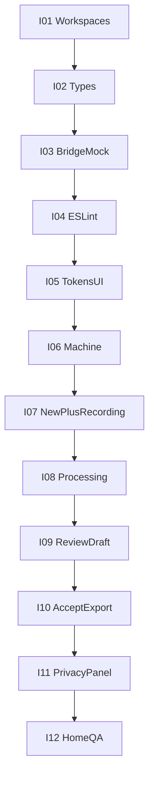

# Entregable frontend — 12 iteraciones medibles

> Plan agile del primer entregable frontend de NotaLocal.
> Cada iteración cierra con un criterio pass/fail verificable en minutos.
> Referencia de producto: [FRONTEND_UIUX_GUIDE.md](FRONTEND_UIUX_GUIDE.md).

## Contexto

Repo con documentación de ingeniería. Entregable: renderer desktop con `bridge/mock.ts` + Home website. Sin Electron real, QVAC, SQLite ni claims legales.

**Regla de corte:** una iteración = **1 objetivo + 1 criterio pass/fail**. Si no se puede verificar en <5 minutos, la iteración es demasiado grande.

**Contrato UX ya decidido:** I3 (split Review), I4 (7 secciones), I5 (formulario vacío opcional).

---

## Cómo medir cada iteración

| Campo | Uso |
| --- | --- |
| **Hecho** | Lista corta de archivos/comportamiento |
| **Medible** | Comando o checklist binario (sí/no) |
| **DoD común** | Compila; copy vs §12 de la guía UI-UX; sin datos clínicos reales; commit listo |

**Fuera de alcance global:** SourceEvidencePopover completo, export a archivo, Privacy/Security legales, Requirements con cifras, live transcript, tema oscuro.

---

## I01 — Workspaces arrancables

**Hecho:** monorepo (`apps/website`, `apps/desktop`, `packages/ui`, `packages/types`) con Vite + React + TS + Tailwind; shells `App.tsx` vacíos.

**Medible:**

- [ ] `pnpm install` exitoso
- [ ] `pnpm dev:desktop` sirve HTML React
- [ ] `pnpm dev:website` sirve HTML React

---

## I02 — Tipos compartidos

**Hecho:** `packages/types` con `Encounter`, `TranscriptSegment`, `ClinicalNote`, `ProductState` (9 estados), `AiState`, `FieldValue`, `section_id` × 7 (I4).

**Medible:**

- [ ] `pnpm --filter @notalocal/types exec tsc --noEmit` exitoso
- [ ] Desktop importa `ProductState` sin error de tipos

---

## I03 — Bridge mock

**Hecho:** `bridge/notalocal.ts` + `mock.ts` con `startEncounter`, `stopEncounter`, `generateNote`, `saveNote` y fixtures sintéticos evidentes.

**Medible:**

- [ ] Script o test: `start` → `stop` → `generateNote` resuelve nota con 7 secciones
- [ ] Ningún fixture con nombre/DNI real

---

## I04 — ESLint de seguridad

**Hecho:** reglas `no-restricted-*` en `apps/desktop/src` para `dangerouslySetInnerHTML`, `localStorage`, `console.log`, `require`.

**Medible:**

- [ ] Archivo de prueba temporal con `dangerouslySetInnerHTML` hace fallar `pnpm lint:desktop`
- [ ] Tras quitarlo, lint pasa

---

## I05 — Tokens + 3 primitivas

**Hecho:** `tokens.ts` (surface, text, border, accent sobrio, estados, `recording`); `Button`, `Card`, `StatusBadge` exportados por `packages/ui`.

**Medible:**

- [ ] Device Ready stub muestra 1 Button + 1 Card + 1 StatusBadge “Inferencia local”
- [ ] Token `recording` existe y no se usa fuera de grabación (grep / revisión)

---

## I06 — Máquina de estados

**Hecho:** `encounterMachine.ts` + `useEncounter.ts`; pantallas aún pueden ser placeholders por estado.

**Medible:**

- [ ] Vitest: transición válida `IDLE` → `RECORDING` → … → `EXPORTED`
- [ ] Vitest: `ACCEPTED` sin `READY_FOR_REVIEW` **falla**
- [ ] Vitest: indicador de grabación solo si estado === `RECORDING`

---

## I07 — New Consultation + Recording

**Hecho:** New Consultation (etiqueta/tipo opcionales, I5; se puede empezar vacío); Recording con color + icono + texto + timer.

**Medible:**

- [ ] Botón “Comenzar grabación” habilitado con formulario vacío
- [ ] En `RECORDING`, las 4 señales son visibles sin scroll
- [ ] Fuera de `RECORDING`, ninguna de esas 4 señales aparece

---

## I08 — Processing

**Hecho:** pantalla Processing con etapas `TRANSCRIBING` → `STRUCTURING`; mock con delay; copy humano (§12.3); sin % inventados.

**Medible:**

- [ ] Tras Stop, UI muestra “Transcribiendo la consulta…” y luego “Organizando la nota…”
- [ ] Grep: no hay “%” ni ETA hardcodeado en Processing
- [ ] Al terminar mock, estado = `READY_FOR_REVIEW`

---

## I09 — Review borrador (split)

**Hecho:** layout I3 (borrador primario | transcript secundario); 7 `ClinicalNoteSection` (I4); badge permanente “Borrador — requiere revisión médica”; `NotStatedBadge`; transcript texto plano.

**Medible:**

- [ ] Badge visible sin scroll en viewport desktop estándar
- [ ] Exactamente 7 secciones con títulos I4
- [ ] Editar una sección → estado `EDITING`
- [ ] Stub “Sin origen identificado” visible al menos en una sección

---

## I10 — Aceptar + Export

**Hecho:** `ReviewActions` con aceptación explícita; Export con vista previa + copiar + aviso de salida de ámbito.

**Medible:**

- [ ] “Aceptar” solo con intención explícita (no autoguardado)
- [ ] Tras aceptar, badge → “Revisada por el médico”; Export habilitado
- [ ] Copiar pone texto de la vista previa en clipboard
- [ ] Demo manual: `IDLE` → `EXPORTED` en un solo recorrido

---

## I11 — PrivacyStatusPanel

**Hecho:** 5 filas de estado; sin dato del backend → `DESCONOCIDO` (nunca asume `LOCAL`).

**Medible:**

- [ ] Test: sin props de privacidad → UI muestra `DESCONOCIDO`
- [ ] Test: con dato `local` → muestra “Procesado localmente” / equivalente
- [ ] Panel visible en Settings o compacto en New Consultation

---

## I12 — Home + QA pre-demo

**Hecho:** Home §2.1 (titular, subtítulo, CTAs, badge inferencia local, captura sintética); test texto plano en transcript; checklist manual.

**Medible:**

- [ ] Home carga; titular: “La consulta termina. La nota ya está lista.”
- [ ] Cero formularios de paciente en website
- [ ] Test: `TranscriptSegment` con `<script>` se ve literal
- [ ] Checklist: grabación visible | badge borrador | privacidad no miente → 3/3

---

## Burndown del entregable

| Hito | Iteraciones | Capacidad demo |
| --- | --- | --- |
| Andamiaje seguro | I01–I04 | Apps corren + tipos + mock + lint |
| UI + estado | I05–I06 | Primitivas + máquina testeada |
| Flujo captura | I07–I08 | Hasta “organizando nota” |
| Corazón producto | I09–I10 | Revisar → aceptar → copiar |
| Confianza + cierre | I11–I12 | Privacidad honesta + Home + QA |

**Éxito final:** juez recorre en <2 min dispositivo listo → grabar (mock) → procesar → revisar con badge → aceptar → copiar, y entiende que la IA no decide.
